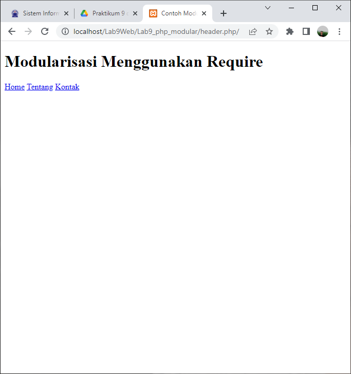
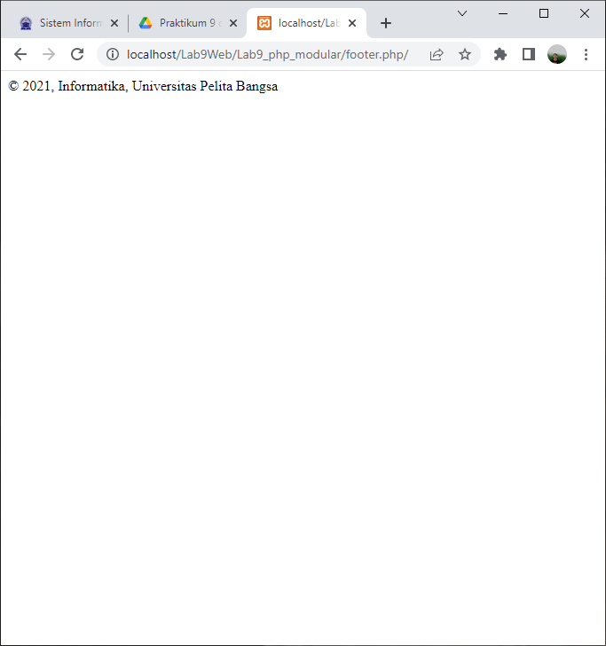
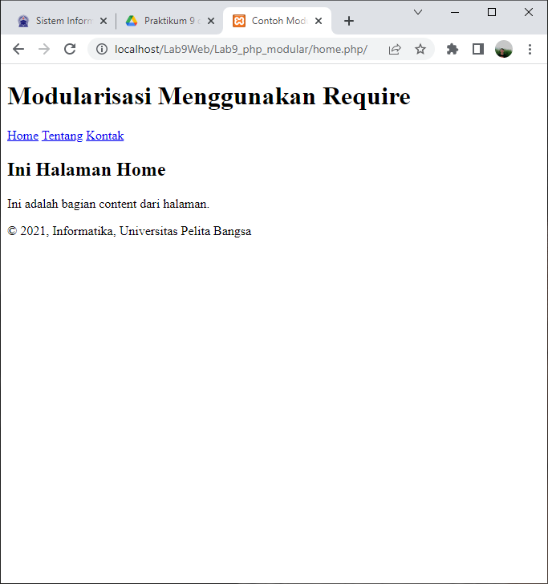
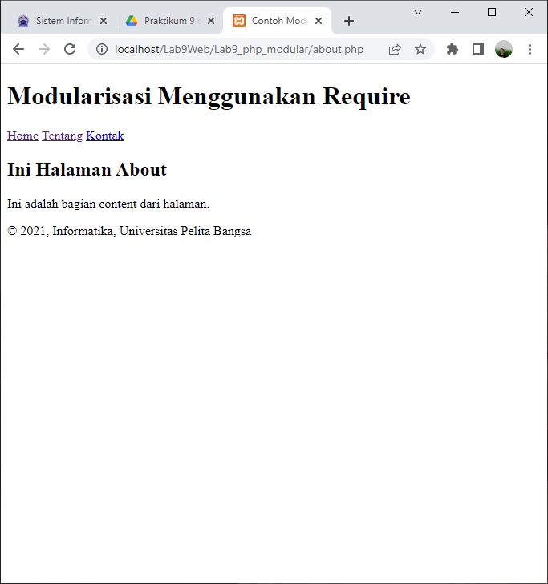

## Nama  : Mohammad Sofiyan 
## NIM   : 312010225 
## kelas : TI.20.A2
## matkul: Pemrograman Web

## Langkah pertama 

Membuat haeder Require

## langkah kedua

Membuat footer Require

## langkah ketiga

Membuat home Require

## langkah keempat

Membuat about Require